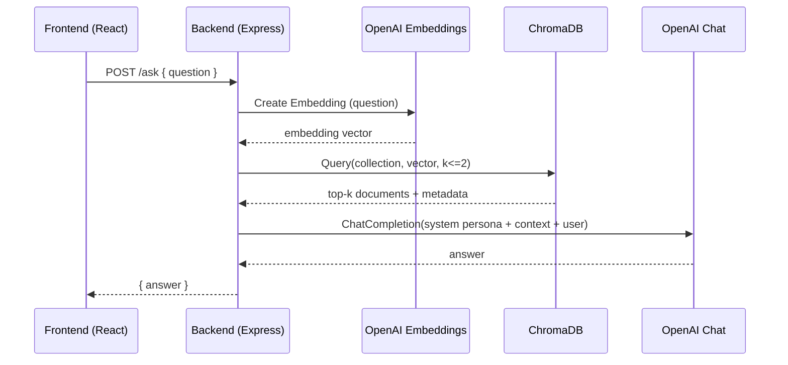

# Project Structure Definition: ChandniBot

This document provides a detailed, high-signal map of the repository to help both humans and AI agents understand how the project is organized and how data flows through the system.

- Name: ChandniBot (persona-bot)
- Purpose: A friendly, witty, supportive chatbot that responds in Chandni’s tone, with RAG over her notes.

## Top-Level Layout

```
chandni-bot/
├─ backend/
│  ├─ server.js               # Express API with /ask and /health
│  ├─ package.json            # Backend dependencies & scripts
│  ├─ .env.example            # Backend env template
│  └─ .env                    # Backend secrets (not committed)
│
├─ frontend/
│  ├─ index.html              # Vite entry HTML (title = ChandniBot)
│  ├─ package.json            # Frontend dependencies & scripts
│  ├─ vite.config.js          # Vite config
│  ├─ tailwind.config.js      # Tailwind config
│  ├─ postcss.config.js       # PostCSS config
│  └─ src/
│     ├─ main.jsx             # React entry
│     ├─ index.css            # Tailwind base
│     └─ App.jsx              # Chat UI (messages, input, send)
│
├─ scripts/
│  ├─ loadData.js             # Data ingestion: read .txt/.md → embed → ChromaDB
│  └─ data/                   # Place persona docs here
│     └─ chandni-notes.md     # Example notes (can add more)
│
├─ README.md                  # Setup, run, and deployment guide
├─ STRUCTURE.md               # This structure definition document
├─ package.json               # Root (monorepo), shared deps for scripts, `type: module`
└─ .gitignore
```

## Core Responsibilities

- backend/server.js
  - Provides REST endpoint `POST /ask` that:
    - Embeds the incoming question with OpenAI embeddings (`text-embedding-3-small`).
    - Queries ChromaDB collection for top-k similar documents (`CHROMA_COLLECTION`).
    - Builds a persona-aware prompt and calls OpenAI Chat (`OPENAI_MODEL`).
    - Returns `{ answer }`.
  - Provides `GET /health` for status checks.
  - Persona name comes from `PERSONA_NAME` (default: Chandni if env not set).

- scripts/loadData.js
  - Recursively reads `.txt` and `.md` files under `scripts/data/`.
  - Chunks content, generates embeddings with OpenAI, and upserts to ChromaDB collection.
  - Default collection is `persona-knowledge` (configurable via `CHROMA_COLLECTION`).

- frontend/src/App.jsx
  - Minimal chat UI with role-based bubbles.
  - Calls backend `/ask` using `VITE_API_URL` or defaults to `http://localhost:3001`.
  - Displays messages and a typing indicator.

## Environment Variables

Backend (`backend/.env`):
- PORT: default `3001`
- OPENAI_API_KEY: your OpenAI key
- OPENAI_MODEL: default `gpt-4o-mini`
- CHROMA_URL: default `http://localhost:8000`
- CHROMA_COLLECTION: default `persona-knowledge`
- PERSONA_NAME: e.g., `Chandni`

Frontend (`frontend/.env`):
- VITE_API_URL: e.g., `http://localhost:3001`

Root (for scripts):
- Inherits environment when running `node scripts/loadData.js`.

## Data Flow (RAG)



## Request/Response Contract

- POST `backend/ask`
  - Request JSON: `{ "question": "string" }`
  - Response JSON: `{ "answer": "string" }`

- GET `backend/health`
  - Response JSON: `{ status: "ok", name: "<PersonaName>Bot", chroma: "<url>" }`

## Key Functions and Behaviors

- server.js
  - `buildPersonaPrompt()`
    - Produces style and tone guidance for the chatbot.
    - Contains light “easter egg” responses to certain keywords.
  - Retrieval robustness
    - Counts documents when possible and adjusts `nResults` (1..2).
    - Wraps Chroma query in try/catch; falls back to no-context answers if retrieval fails.

- scripts/loadData.js
  - `readAllTextFiles(dir)`: recursively enumerates `.md`/`.txt` files.
  - `chunkText(text, chunkSize=2500, overlap=200)`: basic text chunking.
  - Adds embeddings and documents into Chroma collection with minimal metadata.

## Local Development

- Start ChromaDB (Docker):
  ```bash
  docker run -d --name chroma -p 8000:8000 chromadb/chroma:latest
  ```
- Backend:
  ```bash
  cd backend
  npm install
  cp .env.example .env  # set OPENAI_API_KEY, PERSONA_NAME
  npm run dev
  # API at http://localhost:3001
  ```
- Frontend:
  ```bash
  cd frontend
  npm install
  npm run dev
  # App at http://localhost:5173
  ```
- Ingest Data:
  ```bash
  cd scripts
  node loadData.js ./data
  ```

## Deployment

- Backend → Railway/Render
  - Set env: `OPENAI_API_KEY`, `CHROMA_URL`, `CHROMA_COLLECTION`, `PERSONA_NAME`, `OPENAI_MODEL`.
- Frontend → Vercel
  - Set `VITE_API_URL` to your deployed backend URL.

## Customization & Extension

- Change persona name
  - Set `PERSONA_NAME` in `backend/.env`.
- Change collection name
  - Set `CHROMA_COLLECTION` in `backend/.env` and ingestion script.
- Persona tone & easter eggs
  - Edit `buildPersonaPrompt()` in `backend/server.js`.
- Auth (optional)
  - Add middleware in `backend/server.js` and gate `/ask`.
- Voice (bonus)
  - Integrate TTS (e.g., ElevenLabs) in backend and stream audio to frontend.
- Slack (bonus)
  - Use Slack Bolt in a separate worker to forward messages to `/ask`.

## Conventions

- Code style: ES modules throughout (`type: module`).
- Errors: API returns JSON with `{ error }` and appropriate HTTP codes.
- Security: Never commit real API keys; `.env` is gitignored.

## Known Considerations

- Chroma compatibility: some versions respond with 422 for certain include fields; the backend avoids `ids` in queries and handles failures gracefully.
- Rate limits/costs: embeddings and chat requests incur usage; consider caching if needed.

---
This file aims to be a concise, high-quality map of the system. If anything changes (endpoints, flows, or directories), update this document to keep AI agents and humans aligned.
